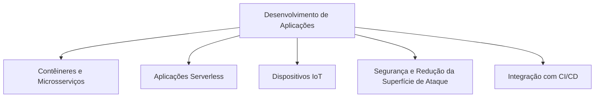
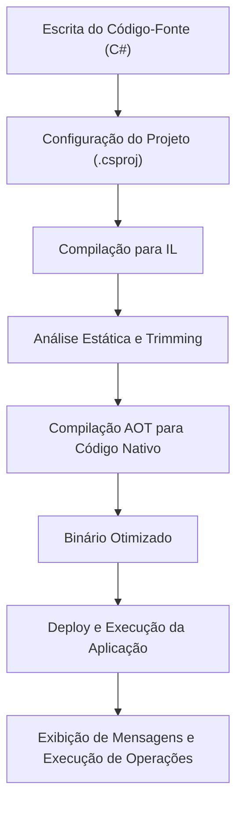
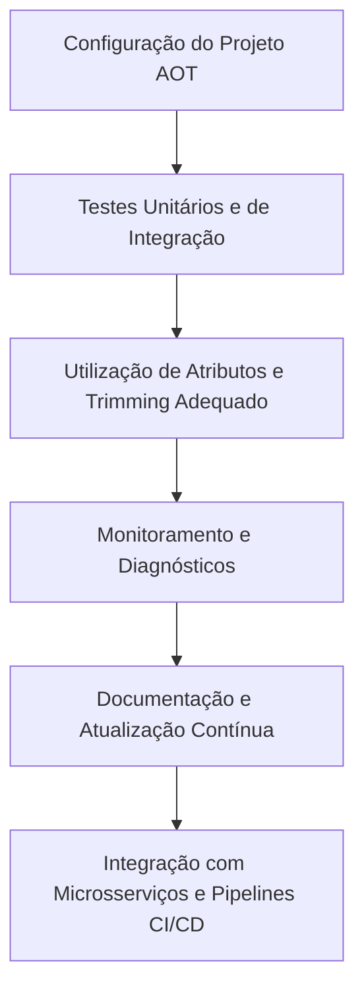

<!--
title: "AOT no .NET: Compilação Antecipada para Performance e Segurança"
description: "Artigo técnico detalhado sobre a funcionalidade AOT no .NET, abordando desde os conceitos fundamentais até exemplos práticos e melhores práticas para a implementação em aplicações modernas, com foco em performance, segurança e integração com microsserviços."
-->

# AOT no .NET: Compilação Antecipada para Performance e Segurança

## Introdução

O desenvolvimento de aplicações de alto desempenho e alta segurança exige técnicas que vão além da simples compilação Just-In-Time (JIT). Uma das abordagens que tem ganhado destaque no ecossistema .NET é a compilação Ahead-of-Time (AOT). Com o AOT, o código intermediário (IL) é convertido em código nativo durante o processo de build, eliminando, assim, a sobrecarga de compilação em tempo de execução e melhorando significativamente os tempos de inicialização, o uso de memória e, consequentemente, a segurança da aplicação.

Inicialmente, técnicas de AOT foram introduzidas de forma experimental no .NET Core 3.0 para plataformas como UWP e Xamarin. Com o tempo, essas técnicas evoluíram e, atualmente, o **.NET 8** (ou superior) oferece suporte robusto e integrado para AOT, trazendo melhorias notáveis em performance e diagnósticos. Essa funcionalidade se mostra especialmente relevante em cenários que exigem rápida inicialização e baixa latência, como em contêineres, aplicações serverless e dispositivos IoT, além de contribuir para a redução da superfície de ataque em aplicações sensíveis.

Este artigo destina-se a desenvolvedores e arquitetos de software com conhecimento intermediário sobre técnicas como AOT e Trimming, oferecendo uma visão completa que abrange desde os conceitos básicos até as práticas avançadas de implementação. Abordaremos exemplos práticos com código em C#, exploraremos cenários de uso, discutiremos a arquitetura interna do AOT e forneceremos recomendações para garantir que a integração dessa tecnologia seja feita com foco na performance, na segurança e na manutenibilidade do código.

Ao longo deste texto, você aprenderá:

- Os principais cenários de uso para AOT no .NET.
- Os fundamentos e a arquitetura que possibilitam a compilação antecipada.
- Como configurar e utilizar AOT em um projeto .NET com exemplos práticos em C#.
- As melhores práticas para assegurar a qualidade, performance e segurança do código gerado.
- Estratégias avançadas para a integração de AOT em ambientes de microsserviços e aplicações distribuídas.

---

## Contextualização (ou Cenários de Uso)

A aplicação de AOT no .NET tem um impacto significativo em diversos cenários, onde a performance e a segurança são críticas. Nesta seção, discutiremos alguns dos principais contextos onde o AOT pode ser aplicado com sucesso.

### 1. Contêineres e Microsserviços

Em ambientes baseados em contêineres, a redução do tempo de inicialização é crucial para a escalabilidade e a eficiência operacional. A compilação AOT permite a geração de binários nativos que iniciam rapidamente, contribuindo para a agilidade dos deploys e para a otimização dos recursos computacionais. Em arquiteturas de microsserviços, cada serviço pode ser compilado de forma antecipada, assegurando que os contratos de comunicação sejam implementados de maneira consistente e que a performance global do sistema seja maximizada.

### 2. Aplicações Serverless

No paradigma serverless, onde as funções podem ser acionadas esporadicamente e a latência do "cold start" impacta diretamente a experiência do usuário, a compilação AOT se torna uma ferramenta poderosa. Ao eliminar a necessidade de JIT em tempo de execução, o tempo de inicialização é significativamente reduzido, proporcionando uma resposta mais rápida e confiável, o que é essencial para aplicações que demandam alta responsividade.

### 3. Dispositivos IoT e Ambientes com Recursos Limitados

Em dispositivos de Internet das Coisas (IoT), onde os recursos de hardware são frequentemente limitados, a eficiência do código executado é um fator determinante. A geração de binários nativos por meio do AOT não só reduz o consumo de memória e a latência de inicialização, mas também diminui o consumo energético, fator crítico em dispositivos operando com baterias.

### 4. Segurança e Redução da Superfície de Ataque

A compilação antecipada elimina a necessidade de execução de compiladores JIT em tempo de execução, reduzindo os vetores de ataque que podem ser explorados durante o carregamento do código. Além disso, ao integrar o AOT com técnicas de Trimming, é possível reduzir significativamente a quantidade de código que chega a ser executado, diminuindo a superfície de ataque e contribuindo para a segurança geral da aplicação.

### 5. Integração com Pipelines de CI/CD

A incorporação do AOT nos pipelines de build e deploy permite que a geração de binários nativos seja automatizada, facilitando a identificação de problemas em tempo de compilação e garantindo que as versões publicadas sejam otimizadas para performance e segurança. Essa integração é fundamental para projetos que exigem alta confiabilidade e ciclos de deploy frequentes.

### Diagrama: Cenários de Uso do AOT



O diagrama acima ilustra como os diversos cenários de uso se beneficiam da compilação antecipada, destacando as áreas em que o AOT pode trazer melhorias significativas em performance, segurança e eficiência operacional.

---

## Conceitos e Arquitetura (ou Fundamentos)

Para aproveitar plenamente os benefícios do AOT, é fundamental compreender os conceitos subjacentes e a arquitetura que possibilita a compilação antecipada no .NET. Nesta seção, abordaremos os fundamentos teóricos, a evolução histórica e os componentes que compõem essa funcionalidade.

### 1. Definição de AOT

A compilação Ahead-of-Time (AOT) é o processo pelo qual o código intermediário (IL) de uma aplicação é convertido em código nativo antes do tempo de execução. Diferentemente da compilação Just-In-Time (JIT), que realiza essa conversão em tempo real, o AOT produz um binário que já contém instruções nativas otimizadas para a plataforma de destino. Essa abordagem resulta em tempos de inicialização mais rápidos, menor consumo de memória e, muitas vezes, melhor performance durante a execução.

### 2. Evolução Histórica do AOT no .NET

Historicamente, a ideia de compilação antecipada já estava presente em plataformas como o .NET Native para UWP e em projetos de Xamarin, onde a necessidade de desempenho e otimização em dispositivos móveis e embarcados era crítica. Com o lançamento do .NET Core 3.0, experimentos iniciais com AOT começaram a emergir, mas foi com as versões subsequentes, especialmente no .NET 5 e .NET 6, que a tecnologia amadureceu. Atualmente, no **.NET 8** ou superior, o AOT está totalmente integrado ao ecossistema, beneficiando não apenas aplicações tradicionais, mas também cenários modernos como microsserviços e aplicações serverless.

### 3. Componentes Principais do AOT

#### 3.1. Compilador e Ferramentas de Build

No processo de AOT, o compilador .NET utiliza ferramentas especializadas (como o CrossGen e o novo compilador do NativeAOT) para converter o código IL em código nativo. Essa conversão leva em conta as otimizações de tempo de compilação e as características específicas da plataforma de destino, gerando binários que são altamente otimizados para performance.

#### 3.2. Integração com Trimming e Análise Estática

Uma das grandes vantagens do AOT é a possibilidade de integrar essa técnica com o Trimming, que remove código não utilizado. Essa combinação resulta em binários menores e mais seguros, pois elimina-se a presença de código que não é executado, reduzindo a superfície de ataque. A análise estática durante o build permite que o compilador identifique dependências e realize a otimização de forma precisa.

#### 3.3. Runtime Nativo

Ao utilizar AOT, a aplicação roda como um binário nativo, o que significa que o runtime JIT não é necessário para a execução do código. Essa ausência do JIT não só reduz a latência de inicialização, mas também minimiza a quantidade de código que pode ser explorado em termos de segurança.

### 4. Processos e Fluxo de Trabalho do AOT

O fluxo de trabalho típico para a compilação AOT no .NET pode ser resumido nos seguintes passos:

1. **Escrita e Compilação do Código-Fonte:**  
   O código-fonte é escrito em C# e compilado para o Intermediate Language (IL).

2. **Análise e Trimming:**  
   Durante o processo de build, o IL é analisado e, se configurado, o Trimming remove o código não utilizado.

3. **Compilação AOT:**  
   O IL otimizado é convertido em código nativo utilizando ferramentas específicas do .NET, gerando um binário final.

4. **Deploy e Execução:**  
   O binário nativo é implantado e executado sem a necessidade de um compilador JIT, proporcionando tempos de inicialização rápidos e maior eficiência.

### Diagrama: Arquitetura do Processo AOT


Este diagrama ilustra o fluxo de trabalho completo do AOT, destacando a integração de etapas como a análise estática e o Trimming, que resultam em um binário nativo altamente otimizado para performance e segurança.

### 5. Benefícios e Limitações

#### Benefícios

- **Performance Aprimorada:**  
  A eliminação do JIT resulta em tempos de inicialização significativamente menores e uma execução mais rápida.
  
- **Menor Consumo de Memória:**  
  Binários otimizados e a remoção de código não utilizado reduzem o footprint de memória.
  
- **Segurança Reforçada:**  
  A ausência de um compilador JIT em tempo de execução diminui os vetores de ataque e permite uma análise de código mais rigorosa durante o build.
  
- **Previsibilidade:**  
  A geração de binários nativos oferece maior consistência no comportamento da aplicação, uma vez que a conversão é realizada em tempo de compilação.

#### Limitações

- **Compatibilidade:**  
  Nem todas as bibliotecas e frameworks são totalmente compatíveis com AOT, exigindo testes extensivos.
  
- **Tempo de Build:**  
  O processo de compilação AOT pode aumentar o tempo total de build, especialmente em projetos de grande escala.
  
- **Debugging:**  
  A depuração de binários nativos pode ser mais desafiadora quando comparada ao código compilado via JIT.

---

## Exemplo Prático

Nesta seção, apresentamos um exemplo prático detalhado que demonstra como configurar e utilizar a compilação AOT em um projeto .NET. O exemplo a seguir ilustra a criação de uma aplicação console simples e a configuração do projeto para gerar um binário nativo utilizando as funcionalidades do .NET 8.

### 1. Estrutura do Projeto

O exemplo consiste em dois componentes principais:

- **Projeto de Aplicação (MyAOTApp):** Uma aplicação console simples escrita em C#.
- **Configuração de Build AOT:** Ajustes no arquivo de projeto para habilitar a compilação AOT e o Trimming.

### 2. Configuração do Projeto (.csproj)

No arquivo de projeto do MyAOTApp, é necessário habilitar a compilação AOT e configurar o Trimming para remover código não utilizado. A seguir, um exemplo de configuração:

```csharp
<Project Sdk="Microsoft.NET.Sdk">
  
  <PropertyGroup>
    <OutputType>Exe</OutputType>
    <TargetFramework>net8.0</TargetFramework>
    <PublishAot>true</PublishAot>
    <PublishTrimmed>true</PublishTrimmed>
    <!-- O TrimMode pode ser ajustado para "link" ou "copyused", conforme necessário -->
    <TrimMode>link</TrimMode>
    <InvariantGlobalization>true</InvariantGlobalization>
  </PropertyGroup>
  
  <ItemGroup>
    <!-- Referências adicionais podem ser configuradas conforme necessário -->
  </ItemGroup>
  
</Project>
```

### 3. Código-Fonte da Aplicação

O exemplo a seguir demonstra uma aplicação console simples que realiza operações básicas e exibe mensagens na tela. O foco principal é ilustrar que, com as configurações de AOT habilitadas, o código será compilado em um binário nativo.

```csharp
using System;

namespace MyAOTApp
{
    public class Program
    {
        public static void Main(string[] args)
        {
            Console.WriteLine("Aplicação AOT iniciada com sucesso.");
            int resultado = CalcularSoma(10, 20);
            Console.WriteLine($"Resultado da soma: {resultado}");
            
            // Simulação de operação intensiva
            RealizarOperacoes();
        }
  
        public static int CalcularSoma(int a, int b)
        {
            return a + b;
        }
  
        public static void RealizarOperacoes()
        {
            // Exemplo de operação que poderia se beneficiar de otimizações AOT
            for (int i = 0; i < 1000; i++)
            {
                // Operação dummy para simulação de carga de trabalho
                Console.Write(".");
            }
            Console.WriteLine("\nOperações concluídas.");
        }
    }
}
```

### 4. Fluxo de Execução do Exemplo

A seguir, um diagrama que ilustra o fluxo de execução do exemplo prático, destacando as etapas da compilação AOT e o funcionamento do binário gerado:



Este diagrama demonstra como o processo de AOT se integra ao fluxo de build, culminando na execução de um binário nativo que proporciona maior performance e menor tempo de inicialização.

---

## Boas Práticas

A implementação do AOT no .NET deve ser acompanhada de um conjunto de boas práticas para garantir que os benefícios da compilação antecipada sejam plenamente aproveitados sem comprometer a manutenibilidade ou a segurança da aplicação. A seguir, listamos recomendações fundamentais:

### 1. Validação e Testes Abrangentes

- **Testes Unitários e de Integração:**  
  Garanta que todas as funcionalidades da aplicação sejam testadas com builds AOT. Devido às diferenças entre a compilação JIT e AOT, é fundamental validar que o comportamento da aplicação permanece consistente.

- **Testes de Performance:**  
  Meça os tempos de inicialização, uso de memória e desempenho geral da aplicação para identificar possíveis gargalos introduzidos pelo processo de AOT.

### 2. Configuração Adequada do Trimming

- **Utilize Atributos de Preservação:**  
  Combine AOT com técnicas de Trimming utilizando atributos como `[DynamicallyAccessedMembers]` para garantir que o código essencial não seja removido inadvertidamente durante o processo de otimização.

- **Ajuste do TrimMode:**  
  Se necessário, experimente diferentes modos de trimming (por exemplo, "link" versus "copyused") para equilibrar a redução do binário com a preservação da funcionalidade.

### 3. Monitoramento e Diagnósticos

- **Integre Ferramentas de Diagnóstico:**  
  Utilize ferramentas de profiling e logging para monitorar a performance do binário nativo em produção. Isso pode ajudar a identificar problemas relacionados à inicialização e ao consumo de recursos.

- **Relate e Analise Warnings:**  
  Preste atenção aos warnings gerados durante a compilação AOT. Eles podem indicar possíveis problemas de compatibilidade ou áreas onde o código pode ser otimizado.

### 4. Documentação e Manutenção

- **Documente as Configurações de Build:**  
  Mantenha uma documentação detalhada das configurações utilizadas para habilitar o AOT e o Trimming, facilitando a manutenção e a transferência de conhecimento entre as equipes.

- **Atualize Dependências:**  
  Como o AOT e as ferramentas associadas evoluem rapidamente, mantenha suas dependências e ferramentas de build atualizadas para aproveitar as últimas melhorias e correções de segurança.

### 5. Integração com Microsserviços

- **Padronize a Configuração:**  
  Em arquiteturas de microsserviços, garanta que todos os serviços que utilizam AOT sigam padrões consistentes de configuração e testes, evitando discrepâncias que possam comprometer a comunicação entre os serviços.

- **Automatize Builds e Deploys:**  
  Configure pipelines de CI/CD que realizem builds AOT automaticamente, integrando testes de performance e validação de segurança para cada novo deploy.

### Diagrama: Boas Práticas na Implementação AOT



Este diagrama resume o conjunto de boas práticas que devem ser seguidas para implementar AOT de forma eficaz, garantindo que os benefícios de performance e segurança sejam alcançados sem comprometer a manutenibilidade da aplicação.

---

## Conclusão

A compilação Ahead-of-Time (AOT) no .NET representa um avanço significativo para o desenvolvimento de aplicações de alto desempenho e alta segurança. Ao converter o código intermediário em binários nativos durante o processo de build, o AOT elimina a sobrecarga associada ao JIT, resultando em tempos de inicialização mais rápidos, menor consumo de memória e uma redução na superfície de ataque da aplicação.

Neste artigo, abordamos de forma abrangente:

- **Introdução e Contextualização:**  
  Exploramos os cenários onde o AOT se mostra mais vantajoso, tais como contêineres, aplicações serverless, dispositivos IoT e ambientes de microsserviços.

- **Conceitos e Arquitetura:**  
  Discutimos os fundamentos teóricos do AOT, a evolução histórica dessa tecnologia no .NET e os principais componentes envolvidos, como a integração com Trimming e a conversão para código nativo.

- **Exemplo Prático:**  
  Apresentamos um exemplo completo de uma aplicação console configurada para AOT no .NET 8, demonstrando a configuração do projeto, o código-fonte e o fluxo de execução do binário nativo.

- **Boas Práticas:**  
  Foram detalhadas as recomendações para garantir que a implementação do AOT seja feita com foco na performance, segurança e manutenibilidade, incluindo testes abrangentes, monitoramento e integração com pipelines de CI/CD.

Com o suporte robusto oferecido pelo .NET 8 ou superior, a adoção do AOT não apenas melhora a performance e a segurança, mas também prepara as aplicações para enfrentar os desafios de ambientes altamente escaláveis e distribuídos. Ao seguir as melhores práticas apresentadas, desenvolvedores avançados estarão aptos a criar soluções que se destacam tanto pela eficiência quanto pela robustez.

A contínua evolução das ferramentas e do runtime .NET indica que o futuro da compilação antecipada é promissor, oferecendo cada vez mais recursos e otimizações que beneficiam desde pequenas aplicações até complexas arquiteturas de microsserviços. Investir em AOT é, portanto, uma estratégia que pode proporcionar ganhos significativos em performance e segurança, contribuindo para o desenvolvimento de sistemas mais ágeis e confiáveis.

---

## Referências

- [Documentação Oficial do .NET – Compilação AOT](https://learn.microsoft.com/dotnet/core/deploying/native-aot)
- [Guia de Publicação com NativeAOT no .NET](https://learn.microsoft.com/dotnet/core/deploying/native-aot/)
- [Desempenho e Segurança com AOT no .NET 8](https://learn.microsoft.com/dotnet/core/diagnostics/)
- [Integração de Microsserviços com .NET: Padrões e Práticas](https://learn.microsoft.com/dotnet/architecture/microservices/)
- [Opções de corte](https://learn.microsoft.com/pt-br/dotnet/core/deploying/trimming/trimming-options) ou [Cortar implantações e executáveis autossuficientes](https://learn.microsoft.com/pt-br/dotnet/core/deploying/trimming/trim-self-contained)
- [Análise de Segurança em Aplicações .NET](https://learn.microsoft.com/dotnet/standard/security/)

---

*Nota Final:*  
Este artigo foi desenvolvido para oferecer uma visão completa e prática sobre a compilação AOT no .NET, combinando conceitos teóricos, exemplos detalhados em C# e recomendações avançadas para a criação de aplicações robustas e seguras. Embora o conteúdo se aproxime de uma referência extensa, a profundidade dos tópicos abordados ressalta a importância de uma implementação consciente e bem planejada, especialmente em ambientes que demandam alta performance e segurança. Recomenda-se a contínua consulta à documentação oficial e a participação na comunidade .NET para acompanhar as inovações e as melhores práticas emergentes neste campo.

---

*Este artigo destina-se a desenvolvedores avançados que buscam explorar o potencial da compilação AOT no .NET, integrando técnicas de otimização e segurança para a criação de soluções escaláveis, eficientes e preparadas para os desafios do desenvolvimento moderno.*
