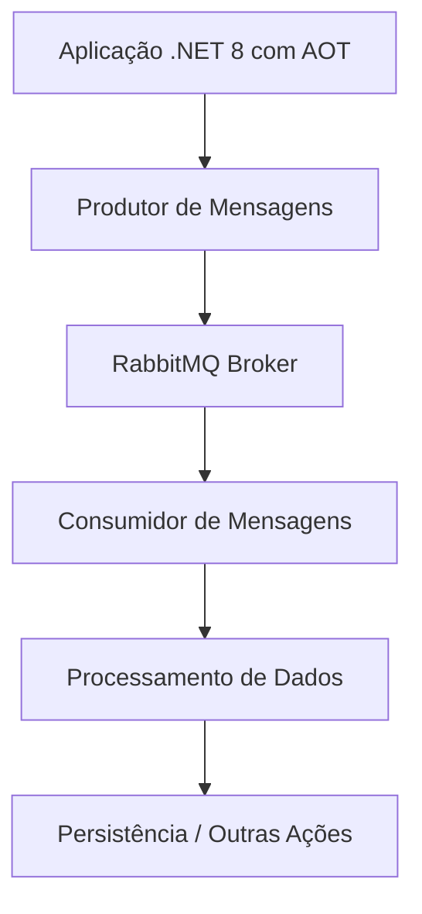

<!--
title: "Projeto de Fila com RabbitMQ e AOT no .NET 8: Um Guia Prático"
description: "Um artigo detalhado sobre a integração de RabbitMQ com AOT no .NET 8, abordando desde os fundamentos e arquitetura até um exemplo prático e as melhores práticas para a implementação em ambientes de microsserviços."
-->

# Projeto de Fila com RabbitMQ e AOT no .NET 8: Um Guia Prático

---

## Introdução

A evolução constante do ecossistema .NET, especialmente com o lançamento do .NET 8, tem impulsionado novas formas de desenvolver aplicações de alta performance e escalabilidade. Entre as inovações, destaca-se o suporte aprimorado para **AOT (Ahead-of-Time Compilation)**, que permite compilações antecipadas do código para reduzir tempos de inicialização e consumo de memória, além de melhorias significativas no **Trimming** e na utilização de **Source Generators**.

Simultaneamente, a integração de filas de mensagens, como o **RabbitMQ**, tem se consolidado como uma prática essencial para arquiteturas de microsserviços e sistemas distribuídos. O RabbitMQ, com sua robusta implementação do protocolo AMQP, possibilita a comunicação assíncrona entre componentes, garantindo desacoplamento e resiliência mesmo em cenários de alta demanda e complexidade.

Este artigo é direcionado a desenvolvedores com conhecimento avançado em .NET, Source Generators, AOT e Trimming. O objetivo é explorar, desde os conceitos fundamentais até a implementação prática, como projetar e implementar uma solução que integre RabbitMQ com AOT no .NET 8. Discutiremos os aspectos técnicos, vantagens, desvantagens e as melhores práticas para essa integração.

---

## Contextualização

A integração entre RabbitMQ e AOT no .NET 8 é especialmente relevante em cenários que exigem alta performance e confiabilidade, tais como:

- **Microsserviços de Processamento Assíncrono:** Em arquiteturas distribuídas, a utilização de filas para comunicação entre serviços permite desacoplamento e maior tolerância a falhas.
- **Aplicações de Alta Performance:** O uso de AOT melhora significativamente o tempo de inicialização e a eficiência do código compilado, aspectos críticos para aplicações em ambientes de produção com alta carga.
- **Sistemas com Requisitos Rigorosos de Escalabilidade:** Com o RabbitMQ, é possível balancear a carga e distribuir o processamento entre múltiplos consumidores, enquanto o AOT garante que o runtime esteja otimizado para performance máxima.
- **Integração com Outras Tecnologias:** Em ambientes que já utilizam Source Generators e trimming, a integração com AOT e RabbitMQ proporciona um ecossistema completo para a criação de aplicações leves, seguras e de rápida resposta.

Esta combinação torna-se particularmente interessante para empresas que buscam modernizar suas infraestruturas e reduzir os tempos de resposta e o uso de recursos computacionais. O artigo apresentará, ao longo de suas seções, uma visão completa desde a modelagem da arquitetura até a implementação prática de um projeto que utiliza RabbitMQ como broker de mensagens e AOT para otimizar a execução.

---

## Conceitos e Arquitetura

Nesta seção, abordaremos os fundamentos teóricos e a arquitetura do sistema que integra RabbitMQ com AOT no .NET 8. Abordaremos os seguintes tópicos:

- **RabbitMQ e AMQP:**  
  O RabbitMQ é um broker de mensagens que implementa o protocolo AMQP, possibilitando a comunicação assíncrona entre diferentes componentes de um sistema. Ele suporta diversos padrões de integração, tais como *Publish/Subscribe*, *Work Queues* e *Routing*.

- **AOT (Ahead-of-Time Compilation):**  
  A compilação AOT permite que o código seja compilado para uma forma nativa antes mesmo de ser executado, reduzindo o tempo de inicialização e melhorando a performance. No .NET, a funcionalidade de AOT foi inicialmente disponibilizada em contextos específicos, como o .NET Native para UWP, e vem sendo ampliada e refinada nas versões subsequentes, culminando em um suporte robusto no .NET 8.

- **Source Generators e Trimming:**  
  Os Source Generators permitem a criação de código durante o tempo de compilação, otimizando rotinas repetitivas e reduzindo a sobrecarga de reflection. O Trimming, por sua vez, remove partes não utilizadas do código, reduzindo o tamanho do binário final. Em conjunto com AOT, essas tecnologias garantem uma aplicação mais enxuta e eficiente.

- **Integração entre RabbitMQ e AOT:**  
  A combinação dessas tecnologias permite que aplicações distribuídas se beneficiem tanto de uma comunicação assíncrona robusta quanto de um desempenho otimizado na execução. O design orientado a eventos, aliado a uma compilação otimizada, possibilita uma infraestrutura resiliente e de alta performance.

### Arquitetura do Sistema

A seguir, apresentamos um diagrama em **Mermaid** ilustrando a arquitetura proposta:



Neste diagrama, temos:

- **Produtor de Mensagens:**  
  Componente responsável por gerar e enviar mensagens para o RabbitMQ. Utiliza as vantagens do AOT para uma inicialização rápida e menor latência.

- **RabbitMQ Broker:**  
  Atua como intermediário, armazenando as mensagens em filas e garantindo a entrega segura aos consumidores.

- **Consumidor de Mensagens:**  
  Serviço que consome as mensagens da fila e realiza o processamento necessário. Pode ser escalado horizontalmente para suportar cargas elevadas.

- **Processamento de Dados e Persistência:**  
  Após o consumo, as mensagens são processadas e os dados são persistidos ou encaminhados para outras operações conforme a necessidade do sistema.

### Vantagens e Desvantagens de Cada Área

#### RabbitMQ

**Vantagens:**

- **Desacoplamento de Serviços:** Facilita a comunicação assíncrona entre microsserviços.
- **Escalabilidade:** Permite distribuir a carga entre múltiplos consumidores.
- **Tolerância a Falhas:** Recursos como mensagens persistentes e confirmações manuais garantem maior resiliência.

**Desvantagens:**

- **Complexidade na Gestão:** Requer monitoramento e configuração adequada para evitar gargalos.
- **Latência em Cenários de Alto Tráfego:** Pode haver atrasos se não configurado corretamente para escalabilidade.

#### AOT no .NET 8

**Vantagens:**

- **Performance:** Reduz o tempo de inicialização e melhora a execução do código.
- **Redução do Footprint:** Combinado com o trimming, gera binários mais enxutos.
- **Segurança:** Menor superfície para ataques via reflection, pois o código é pré-compilado.

**Desvantagens:**

- **Complexidade na Configuração:** Exige um entendimento profundo para ajustar as configurações de trimming e evitar a remoção acidental de partes necessárias.
- **Compatibilidade:** Nem todas as bibliotecas e frameworks são totalmente compatíveis com AOT, exigindo testes e ajustes específicos.

#### Integração RabbitMQ + AOT

**Vantagens:**

- **Aplicações Altamente Performáticas:** Combina a robustez do RabbitMQ com a eficiência de AOT, resultando em aplicações de resposta rápida e baixo consumo de recursos.
- **Desenvolvimento Moderno:** Aproveita os recursos mais recentes do .NET 8 para produzir aplicações seguras e escaláveis.

**Desvantagens:**

- **Curva de Aprendizado:** Exige conhecimentos avançados em várias tecnologias (AOT, trimming, Source Generators e mensageria).
- **Complexidade na Depuração:** A compilação antecipada pode dificultar a análise de problemas em tempo de execução, exigindo um conjunto robusto de ferramentas de logging e monitoramento.

---

## Exemplo Prático

Nesta seção, apresentaremos um exemplo prático que integra RabbitMQ com um serviço .NET 8 utilizando AOT, demonstrando tanto o envio quanto o consumo de mensagens. O exemplo será dividido em duas partes: o **Produtor** e o **Consumidor**.

### Configuração do Projeto

Para iniciar, vamos criar um projeto .NET 8 utilizando o template de Worker Service. Essa abordagem é ideal para aplicações de background, como consumidores de fila.

Crie o projeto utilizando o seguinte comando:

```bash
dotnet new worker -n RabbitMqAotDemo
```

Em seguida, adicione o pacote **RabbitMQ.Client**:

```bash
dotnet add package RabbitMQ.Client
```

### Implementação do Produtor

A seguir, apresentamos um exemplo de código em C# para a implementação de um produtor de mensagens. Este serviço utiliza injeção de dependências e está preparado para beneficiar-se das melhorias de AOT.

```csharp
using System;
using System.Text;
using RabbitMQ.Client;

namespace RabbitMqAotDemo.Services
{
    public interface IMessageProducer
    {
        void PublishMessage(string queueName, string message);
    }

    public class RabbitMqProducer : IMessageProducer, IDisposable
    {
        private readonly IConnection _connection;
        private readonly IModel _channel;

        public RabbitMqProducer()
        {
            var factory = new ConnectionFactory() { HostName = "localhost", DispatchConsumersAsync = true };
            _connection = factory.CreateConnection();
            _channel = _connection.CreateModel();
        }

        public void PublishMessage(string queueName, string message)
        {
            // Declara a fila garantindo durabilidade para persistência das mensagens
            _channel.QueueDeclare(
                queue: queueName,
                durable: true,
                exclusive: false,
                autoDelete: false,
                arguments: null);

            var body = Encoding.UTF8.GetBytes(message);

            // Publica a mensagem na fila
            _channel.BasicPublish(
                exchange: "",
                routingKey: queueName,
                basicProperties: null,
                body: body);

            Console.WriteLine($"[Produtor] Mensagem enviada: {message}");
        }

        public void Dispose()
        {
            _channel?.Close();
            _connection?.Close();
        }
    }
}
```

### Implementação do Consumidor com Worker Service

Agora, vamos criar um consumidor que processa as mensagens utilizando o padrão **BackgroundService**. Esse consumidor está preparado para trabalhar com AOT, tendo sido compilado previamente e otimizado para inicializações rápidas.

```csharp
using Microsoft.Extensions.Hosting;
using RabbitMQ.Client;
using RabbitMQ.Client.Events;
using System;
using System.Text;
using System.Threading;
using System.Threading.Tasks;

namespace RabbitMqAotDemo.Services
{
    public class RabbitMqConsumerService : BackgroundService, IDisposable
    {
        private IConnection _connection;
        private IModel _channel;

        public RabbitMqConsumerService()
        {
            var factory = new ConnectionFactory() { HostName = "localhost", DispatchConsumersAsync = true };
            _connection = factory.CreateConnection();
            _channel = _connection.CreateModel();

            // Declara a fila utilizada pelo consumidor
            _channel.QueueDeclare(
                queue: "minha_fila",
                durable: true,
                exclusive: false,
                autoDelete: false,
                arguments: null);
        }

        protected override async Task ExecuteAsync(CancellationToken stoppingToken)
        {
            var consumer = new AsyncEventingBasicConsumer(_channel);
            consumer.Received += async (sender, ea) =>
            {
                var body = ea.Body.ToArray();
                var message = Encoding.UTF8.GetString(body);

                Console.WriteLine($"[Consumidor] Mensagem recebida: {message}");

                // Simula o processamento da mensagem
                await ProcessMessageAsync(message);

                // Confirma o processamento da mensagem (para filas configuradas com autoAck: false)
                _channel.BasicAck(deliveryTag: ea.DeliveryTag, multiple: false);
            };

            _channel.BasicConsume(
                queue: "minha_fila",
                autoAck: false,
                consumer: consumer);

            // Mantém o serviço em execução
            while (!stoppingToken.IsCancellationRequested)
            {
                await Task.Delay(1000, stoppingToken);
            }
        }

        private Task ProcessMessageAsync(string message)
        {
            // Implementação do processamento real da mensagem.
            // Deve ser idempotente e resiliente.
            Console.WriteLine($"[Consumidor] Processando mensagem: {message}");
            return Task.CompletedTask;
        }

        public override void Dispose()
        {
            _channel?.Close();
            _connection?.Close();
            base.Dispose();
        }
    }
}
```

### Configurando a Injeção de Dependências

Para que os serviços de produtor e consumidor sejam gerenciados pelo container de injeção de dependências, atualize a classe `Program.cs` do projeto:

```csharp
using Microsoft.Extensions.DependencyInjection;
using Microsoft.Extensions.Hosting;
using RabbitMqAotDemo.Services;

IHost host = Host.CreateDefaultBuilder(args)
    .ConfigureServices((hostContext, services) =>
    {
        // Registra o serviço de consumidor para execução em background
        services.AddHostedService<RabbitMqConsumerService>();

        // Registra o produtor como um serviço singleton para reutilização
        services.AddSingleton<IMessageProducer, RabbitMqProducer>();
    })
    .Build();

await host.RunAsync();
```

### Utilizando AOT e Trimming

Para aproveitar as funcionalidades de AOT no .NET 8, é necessário ajustar as configurações do projeto. No arquivo de projeto (`.csproj`), adicione as seguintes propriedades:

```xml
<PropertyGroup>
  <PublishAot>true</PublishAot>
  <PublishTrimmed>true</PublishTrimmed>
  <InvariantGlobalization>true</InvariantGlobalization>
</PropertyGroup>
```

Essas configurações garantem que a aplicação seja compilada antecipadamente, resultando em um binário otimizado com um tempo de inicialização reduzido e menor consumo de memória.

### Considerações sobre Source Generators

Embora este exemplo não utilize diretamente Source Generators, vale ressaltar que eles podem ser integrados para gerar código repetitivo ou auxiliar na criação de proxies e adaptadores para o RabbitMQ. Em cenários avançados, os Source Generators podem ajudar a garantir que o código gerado seja compatível com os processos de trimming e AOT, evitando referências desnecessárias que poderiam ser removidas.

---

## Boas Práticas

Nesta seção, detalharemos as melhores práticas para a implementação de soluções que integram RabbitMQ com AOT no .NET 8.

### 1. Gerenciamento de Conexões e Canais

- **Centralize a Criação:**  
  Utilize um serviço centralizado para gerenciar as conexões com o RabbitMQ, evitando a criação excessiva de conexões e canais. Isso reduz a sobrecarga e melhora a performance.

- **Encapsulamento e Reutilização:**  
  Encapsule a lógica de criação e configuração em classes dedicadas (como o `RabbitMqProducer`), facilitando a manutenção e a reutilização em diferentes partes da aplicação.

### 2. Configuração de Fila e Mensagens

- **Durabilidade e Persistência:**  
  Configure as filas com o parâmetro `durable: true` e utilize mensagens persistentes para garantir que nenhuma informação seja perdida em caso de falhas ou reinicializações do broker.

- **Confirmação Manual:**  
  Utilize confirmações manuais (`autoAck: false`) no consumidor para assegurar que cada mensagem seja processada corretamente antes de ser removida da fila. Isso é essencial para manter a integridade dos dados em sistemas críticos.

### 3. Monitoramento e Logging

- **Integração com Ferramentas de Monitoramento:**  
  Utilize o RabbitMQ Management Plugin e outras ferramentas de monitoramento para acompanhar o desempenho das filas e identificar possíveis gargalos ou falhas.

- **Logging Detalhado:**  
  Implemente um sistema robusto de logging que capture informações detalhadas sobre o envio e o consumo de mensagens. Isso facilita a identificação de problemas e a análise de performance em ambientes de produção.

### 4. Uso de AOT, Trimming e Source Generators

- **Configuração Adequada:**  
  Certifique-se de configurar corretamente as propriedades de AOT e trimming no arquivo de projeto para evitar a remoção acidental de código necessário. Teste exaustivamente o aplicativo em cenários de produção.

- **Integração com Source Generators:**  
  Se utilizar Source Generators, valide que o código gerado está em conformidade com os requisitos de trimming e AOT. Documente as dependências e certifique-se de que nenhuma referência crítica seja eliminada pelo processo de trimming.

- **Testes de Performance:**  
  Realize testes de performance antes e depois da publicação AOT para medir os ganhos em termos de tempo de inicialização, consumo de memória e throughput.

### 5. Escalabilidade e Resiliência

- **Consumidores Paralelos:**  
  Em cenários de alta demanda, implemente múltiplos consumidores para distribuir a carga de processamento. Utilize estratégias de *scaling out* para garantir que o sistema possa crescer conforme a necessidade.

- **Circuit Breakers e Retries:**  
  Implemente padrões de circuit breaker e estratégias de retry para lidar com falhas transitórias na comunicação com o RabbitMQ. Isso assegura que a aplicação continue operando mesmo em condições adversas.

- **Design Idempotente:**  
  Garanta que o processamento das mensagens seja idempotente, de modo que a reprocessamento de mensagens duplicadas não cause efeitos colaterais indesejados.

### 6. Segurança

- **Conexões Seguras:**  
  Configure o RabbitMQ para utilizar SSL/TLS, garantindo que a comunicação entre os serviços e o broker seja segura e resistente a interceptações.

- **Autenticação e Autorização:**  
  Implemente mecanismos robustos de autenticação e autorização para acessar o RabbitMQ, restringindo o acesso a componentes autorizados.

---

## Conclusão

A integração de RabbitMQ com AOT no .NET 8 representa uma poderosa combinação para a construção de aplicações distribuídas e de alta performance. Ao utilizar RabbitMQ, os desenvolvedores conseguem desacoplar os serviços e garantir uma comunicação assíncrona robusta, enquanto os recursos avançados do .NET 8, como AOT, trimming e Source Generators, proporcionam uma execução mais rápida, um footprint reduzido e maior segurança.

Este artigo abordou desde os conceitos básicos até a implementação prática, apresentando exemplos de código, diagramas de arquitetura e uma série de melhores práticas. A adoção dessas tecnologias pode transformar significativamente a forma como os sistemas são projetados e operados, contribuindo para a criação de soluções resilientes e escaláveis em ambientes modernos de microsserviços.

Embora os desafios técnicos sejam significativos, a correta implementação e configuração dessas tecnologias oferecem vantagens competitivas importantes, como a redução do tempo de inicialização e a otimização do consumo de recursos. Para equipes que já possuem um conhecimento avançado em Source Generators, AOT e trimming, a integração com RabbitMQ abre um leque de possibilidades para a criação de aplicações inovadoras e altamente performáticas.

Recomenda-se que os desenvolvedores continuem a explorar as documentações oficiais e as comunidades de prática para se manterem atualizados com as novas funcionalidades e melhores práticas, garantindo que suas soluções evoluam de acordo com as demandas do mercado e os avanços tecnológicos.

---

## Referências

- **Documentação Oficial do .NET 8:**  
  [What's New in .NET 8](https://learn.microsoft.com/dotnet/core/whats-new/dotnet-8)

- **RabbitMQ Documentation:**  
  [RabbitMQ Official Documentation](https://www.rabbitmq.com/documentation.html)

- **Introdução ao AOT no .NET:**  
  [AOT Compilation in .NET](https://learn.microsoft.com/dotnet/core/deploying/native-aot/)

- **Source Generators:**  
  [Source Generators Overview](https://learn.microsoft.com/dotnet/csharp/roslyn-sdk/source-generators-overview)

- **Trimming no .NET:**  
  [Trim self-contained deployments and executables](https://learn.microsoft.com/en-us/dotnet/core/deploying/trimming/trim-self-contained)
  [Trimming options](https://learn.microsoft.com/en-us/dotnet/core/deploying/trimming/trimming-options)

- **Exemplos Avançados de Integração com Microsserviços:**  
  [Microservices Architecture on .NET](https://learn.microsoft.com/dotnet/architecture/microservices/)

---

*Este artigo forneceu uma visão abrangente e prática sobre a integração entre RabbitMQ e AOT no .NET 8. Para obter o máximo de benefícios dessas tecnologias, recomenda-se um estudo contínuo e a experimentação em ambientes controlados, de forma a validar as melhores práticas e ajustar a implementação às necessidades específicas de cada projeto.*

---
