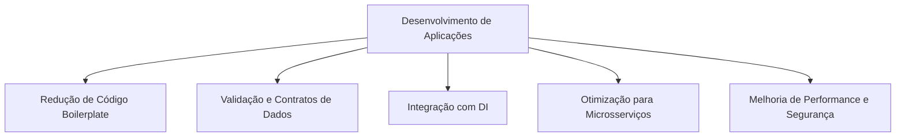
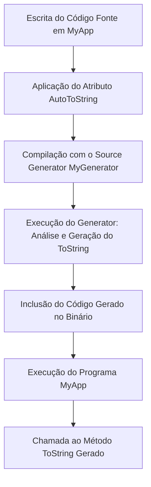
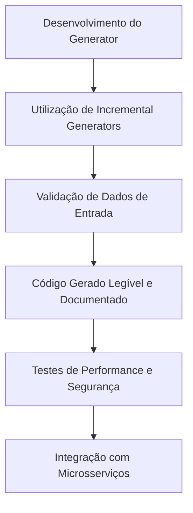

<!--
title: "Source Generators no .NET: Gerando Código com Performance, Segurança e Boas Práticas"
description: "Artigo técnico abrangente sobre a funcionalidade Source Generators no .NET, explorando desde os conceitos básicos até práticas avançadas e integração com microsserviços, com foco em código na prática."
-->

# Source Generators no .NET: Gerando Código com Performance, Segurança e Boas Práticas

## Introdução

A evolução do ecossistema .NET nos últimos anos tem sido marcada pela constante busca por eficiência, modularidade e escalabilidade. Nesse cenário, os **Source Generators** surgem como uma inovação poderosa que permite a geração de código em tempo de compilação, oferecendo benefícios notáveis tanto em termos de performance quanto de segurança. Essa tecnologia foi inicialmente disponibilizada com o lançamento do .NET 5, mas tem sido continuamente aprimorada, atingindo suporte completo e recursos avançados no **.NET 8** e versões superiores.

Para desenvolvedores que já possuem conhecimentos intermediários sobre AOT e Trimming, os Source Generators oferecem uma nova dimensão na automação e otimização de tarefas repetitivas. Eles possibilitam, por exemplo, a geração automática de código boilerplate, a validação de contratos, a integração com frameworks de injeção de dependência e até a criação de APIs mais seguras e consistentes. Ao automatizar esses aspectos, os Source Generators podem reduzir significativamente o tempo de desenvolvimento e minimizar a possibilidade de erros humanos.

Este artigo tem como objetivo oferecer uma visão completa sobre os Source Generators no .NET. Abordaremos desde os conceitos básicos até tópicos avançados, apresentando exemplos práticos em C# que demonstram a implementação dessa funcionalidade, além de discutir boas práticas que garantem a performance e a segurança do código gerado. Também exploraremos cenários de uso que abrangem desde aplicações monolíticas até arquiteturas distribuídas e microsserviços.

Ao longo desta leitura, você aprenderá:

- Quais são os principais cenários de uso dos Source Generators.
- Como eles se integram à pipeline de compilação do .NET e quais os componentes envolvidos.
- Como implementar um Source Generator do zero, com exemplos práticos e detalhados.
- Quais as melhores práticas para garantir que o código gerado seja robusto, seguro e de fácil manutenção.
- Dicas avançadas para integração com microsserviços e para o aprimoramento da performance.

---

## Contextualização (ou Cenários de Uso)

Os Source Generators se tornaram uma ferramenta indispensável para resolver diversos desafios enfrentados no desenvolvimento moderno com .NET. Nesta seção, exploraremos os cenários de uso mais comuns e os benefícios que essa tecnologia pode oferecer em diferentes contextos.

### 1. Redução de Código Boilerplate

Em muitos projetos, grande parte do código é repetitivo, como métodos de mapeamento, implementações de interfaces, propriedades de notificação de mudança (INotifyPropertyChanged), ou a criação de métodos ToString, Equals e GetHashCode. Com os Source Generators, é possível automatizar a criação desse código repetitivo, permitindo que os desenvolvedores se concentrem na lógica de negócio.

### 2. Validação e Contratos de Dados

Em sistemas que dependem fortemente de contratos de dados — por exemplo, ao serializar e deserializar objetos para comunicação via APIs REST ou gRPC — os Source Generators podem ser empregados para gerar automaticamente código de validação, mapeamento e transformação. Essa automação contribui para a consistência dos dados e reduz erros de implementação.

### 3. Integração com Frameworks de Injeção de Dependência

Frameworks modernos de injeção de dependência, como o Microsoft.Extensions.DependencyInjection, podem se beneficiar dos Source Generators para registrar automaticamente serviços e dependências. Isso elimina a necessidade de configurações manuais extensivas, simplificando o processo de inicialização e melhorando a performance do arranque da aplicação.

### 4. Otimização para Microsserviços

Em arquiteturas baseadas em microsserviços, onde cada serviço é desenvolvido e implantado de forma independente, a geração automática de código pode garantir que os contratos de comunicação entre os serviços sejam sempre atualizados e consistentes. Além disso, ao reduzir o código manual, o risco de inconsistências entre os serviços é minimizado.

### 5. Melhorias de Performance e Segurança

Ao gerar código em tempo de compilação, os Source Generators eliminam a necessidade de reflexões e chamadas dinâmicas em tempo de execução, o que pode resultar em melhorias significativas de performance. Ademais, como o código é gerado e compilado juntamente com o projeto, torna-se mais fácil aplicar verificações de segurança e evitar vulnerabilidades comuns, tais como injeção de código ou falhas decorrentes de manipulação incorreta de dados.

### Diagrama: Cenários de Uso dos Source Generators



Este diagrama ilustra como os Source Generators podem ser aplicados em diferentes cenários, contribuindo para a melhoria da qualidade e da performance das aplicações.

---

## Conceitos e Arquitetura (ou Fundamentos)

Para aproveitar todo o potencial dos Source Generators, é fundamental compreender seus conceitos básicos e como eles se integram à arquitetura do compilador Roslyn. Nesta seção, discutiremos os fundamentos teóricos e os componentes essenciais que compõem essa funcionalidade.

### 1. O Que São Source Generators?

Os Source Generators são componentes que se integram à pipeline de compilação do Roslyn e permitem a geração de código em tempo de compilação. Diferentemente das técnicas tradicionais de reflexão ou metaprogramação em tempo de execução, os Source Generators produzem código fonte que é incorporado ao processo de compilação, garantindo que o código gerado seja verificado pelo compilador e, portanto, livre de erros de sintaxe ou de tipo.

### 2. História e Evolução

A funcionalidade de Source Generators foi introduzida inicialmente com o .NET 5, juntamente com o C# 9. Essa abordagem inovadora possibilitou a criação de ferramentas e frameworks que aproveitam o poder da geração de código para automatizar tarefas repetitivas e otimizar a performance das aplicações. Com a chegada do .NET 8, os Source Generators passaram por refinamentos que ampliaram suas capacidades, permitindo uma integração mais profunda com a compilação AOT e o Trimming, bem como a incorporação de diagnósticos avançados.

### 3. Como Funcionam os Source Generators

Os Source Generators operam durante a compilação, inspecionando o código-fonte e gerando novos arquivos de código que são adicionados ao projeto. Esses arquivos gerados são tratados como se tivessem sido escritos manualmente, passando por todas as verificações e otimizações do compilador. O fluxo básico de um Source Generator pode ser descrito da seguinte forma:

1. **Análise do Código-Fonte:** O generator inspeciona o código existente, identificando padrões, atributos ou estruturas que indicam a necessidade de geração de código.
2. **Geração de Código:** Com base na análise, o generator produz código adicional, geralmente utilizando o modelo de árvore de sintaxe abstrata (AST) do Roslyn.
3. **Integração ao Projeto:** O código gerado é inserido na compilação e, consequentemente, faz parte do binário final.

### 4. Componentes Principais

#### 4.1. O Contexto de Geração

O contexto de geração fornece ao Source Generator informações detalhadas sobre o projeto, como a coleção de arquivos fonte, referências e símbolos do compilador. Essa interface é fundamental para que o generator possa tomar decisões precisas sobre o que gerar.

#### 4.2. APIs do Roslyn

Os Source Generators utilizam as APIs do Roslyn para interagir com a árvore de sintaxe do código-fonte. Entre as principais classes e interfaces estão:

- **GeneratorExecutionContext:** Fornece o contexto durante a execução do generator, incluindo acesso a arquivos, símbolos e mecanismos para reportar diagnósticos.
- **SyntaxReceiver:** Uma interface que permite coletar nós relevantes da árvore de sintaxe durante a análise inicial.

#### 4.3. Incremental Generators

Com o passar do tempo, a abordagem dos Source Generators evoluiu para a utilização de *Incremental Generators*, que são mais eficientes em termos de performance. Eles permitem que somente as partes alteradas do código sejam reprocessadas, reduzindo o tempo total de compilação e otimizando a geração de código em projetos de larga escala.

### 5. Benefícios de Gerar Código em Tempo de Compilação

- **Performance:** Ao eliminar a necessidade de reflexões e cálculos dinâmicos em tempo de execução, o código gerado é geralmente mais rápido e consome menos memória.
- **Segurança:** Código gerado é verificado em tempo de compilação, o que ajuda a evitar vulnerabilidades comuns, como falhas de validação e erros de tipagem.
- **Manutenibilidade:** A automação da geração de código reduz a quantidade de código manual e repetitivo, facilitando a manutenção e evolução do projeto.

### Diagrama: Arquitetura de um Source Generator


Este diagrama demonstra como o Source Generator interage com o compilador, desde a análise do código-fonte até a integração dos arquivos gerados no binário final.

---

## Exemplo Prático

Nesta seção, apresentaremos um exemplo prático detalhado de como implementar um Source Generator no .NET. O exemplo abordará a criação de um generator que adiciona automaticamente uma implementação do método `ToString` para classes marcadas com um atributo personalizado. Esse exemplo ilustra tanto a estrutura de um generator quanto as técnicas necessárias para interagir com o modelo de árvore de sintaxe do Roslyn.

### 1. Estrutura do Projeto

Para este exemplo, iremos criar uma solução com dois projetos:

- **MyGenerator:** Um projeto de biblioteca de classes que implementa o Source Generator.
- **MyApp:** Um projeto de aplicação console que utiliza o Source Generator para gerar código em tempo de compilação.

### 2. Projeto MyGenerator

#### 2.1. Implementação do Atributo

Primeiro, definimos um atributo personalizado que será utilizado para marcar as classes que necessitam de um método `ToString` gerado automaticamente.

```csharp
using System;

namespace MyGenerator
{
    [AttributeUsage(AttributeTargets.Class, Inherited = false, AllowMultiple = false)]
    public sealed class AutoToStringAttribute : Attribute
    {
    }
}
```

#### 2.2. Implementação do Source Generator

Em seguida, implementamos o Source Generator. Este generator irá procurar por classes marcadas com o atributo `AutoToStringAttribute` e gerar um método `ToString` que retorna os valores de suas propriedades públicas.

```csharp
using System;
using System.Collections.Generic;
using System.Text;
using Microsoft.CodeAnalysis;
using Microsoft.CodeAnalysis.Text;
using Microsoft.CodeAnalysis.CSharp.Syntax;
using System.Linq;

namespace MyGenerator
{
    [Generator]
    public class ToStringGenerator : ISourceGenerator
    {
        public void Initialize(GeneratorInitializationContext context)
        {
            // Registra um receiver para coletar nós de interesse
            context.RegisterForSyntaxNotifications(() => new SyntaxReceiver());
        }

        public void Execute(GeneratorExecutionContext context)
        {
            // Recupera o receiver criado na inicialização
            if (context.SyntaxReceiver is not SyntaxReceiver receiver)
                return;

            // Adquire o símbolo do atributo para comparação
            INamedTypeSymbol attributeSymbol = context.Compilation.GetTypeByMetadataName("MyGenerator.AutoToStringAttribute");

            foreach (var candidate in receiver.CandidateClasses)
            {
                var model = context.Compilation.GetSemanticModel(candidate.SyntaxTree);
                var classSymbol = model.GetDeclaredSymbol(candidate) as INamedTypeSymbol;
                if (classSymbol == null)
                    continue;

                // Verifica se a classe possui o atributo [AutoToString]
                if (!classSymbol.GetAttributes().Any(ad => ad.AttributeClass.Equals(attributeSymbol, SymbolEqualityComparer.Default)))
                    continue;

                // Gera o código do método ToString
                string classSource = ProcessClass(classSymbol);
                context.AddSource($"{classSymbol.Name}_ToString.g.cs", SourceText.From(classSource, Encoding.UTF8));
            }
        }

        private string ProcessClass(INamedTypeSymbol classSymbol)
        {
            string namespaceName = classSymbol.ContainingNamespace.ToDisplayString();
            var properties = classSymbol.GetMembers().OfType<IPropertySymbol>().Where(p => p.DeclaredAccessibility == Accessibility.Public);

            StringBuilder sb = new StringBuilder($@"
namespace {namespaceName}
{{
    partial class {classSymbol.Name}
    {{
        public override string ToString()
        {{
            return $""{classSymbol.Name}: ");

            bool first = true;
            foreach (var prop in properties)
            {
                if (!first)
                {
                    sb.Append(@", ");
                }
                sb.Append($"{prop.Name} = {{{prop.Name}}}");
                first = false;
            }

            sb.Append(@""";
        }
    }
}}
");
            return sb.ToString();
        }

        /// <summary>
        /// Coleta classes que podem ser candidatas à geração do método ToString.
        /// </summary>
        private class SyntaxReceiver : ISyntaxReceiver
        {
            public List<ClassDeclarationSyntax> CandidateClasses { get; } = new List<ClassDeclarationSyntax>();

            public void OnVisitSyntaxNode(SyntaxNode syntaxNode)
            {
                // Procura por declarações de classe que possuam atributos
                if (syntaxNode is ClassDeclarationSyntax classDeclaration && classDeclaration.AttributeLists.Count > 0)
                {
                    CandidateClasses.Add(classDeclaration);
                }
            }
        }
    }
}
```

#### 2.3. Configuração do Projeto MyGenerator

No arquivo de projeto do MyGenerator, certifique-se de referenciar os pacotes necessários para utilizar as APIs do Roslyn:

```csharp
<Project Sdk="Microsoft.NET.Sdk">

  <PropertyGroup>
    <TargetFramework>net8.0</TargetFramework>
    <LangVersion>9.0</LangVersion>
    <OutputItemType>Analyzer</OutputItemType>
    <IncludeBuildOutput>false</IncludeBuildOutput>
  </PropertyGroup>

  <ItemGroup>
    <PackageReference Include="Microsoft.CodeAnalysis.CSharp" Version="4.8.0" PrivateAssets="all" />
    <PackageReference Include="Microsoft.CodeAnalysis.Analyzers" Version="3.3.3" PrivateAssets="all" />
  </ItemGroup>

</Project>
```

### 3. Projeto MyApp

No projeto de aplicação, vamos utilizar o atributo e o generator para ver o código gerado em ação.

#### 3.1. Definição de uma Classe com o Atributo

```csharp
using MyGenerator;

namespace MyApp
{
    [AutoToString]
    public partial class Person
    {
        public string FirstName { get; set; }
        public string LastName { get; set; }
        public int Age { get; set; }
    }
}
```

#### 3.2. Uso da Classe no Programa

```csharp
using System;

namespace MyApp
{
    class Program
    {
        static void Main(string[] args)
        {
            var person = new Person 
            { 
                FirstName = "João", 
                LastName = "Silva", 
                Age = 30 
            };
            Console.WriteLine(person.ToString());
        }
    }
}
```

### 4. Fluxo de Execução do Exemplo

A seguir, um diagrama Mermaid que ilustra o fluxo de execução do exemplo prático, desde a compilação até a utilização do código gerado:



Este exemplo demonstra como os Source Generators podem automatizar a criação de código, eliminando tarefas repetitivas e garantindo a consistência do código gerado.

---

## Boas Práticas

A criação de Source Generators poderosos e confiáveis exige a adoção de boas práticas tanto no desenvolvimento do generator quanto na sua utilização. A seguir, listamos recomendações essenciais para garantir performance, segurança e manutenibilidade.

### 1. Utilize Incremental Generators Sempre que Possível

Os **Incremental Generators** são uma evolução dos Source Generators tradicionais, permitindo que somente as partes alteradas do código sejam reprocessadas. Isso pode reduzir drasticamente o tempo de compilação em projetos grandes. Se o seu cenário permitir, prefira a implementação incremental.

### 2. Valide os Dados de Entrada

Como os generators operam em tempo de compilação, é crucial validar os dados de entrada (por exemplo, os atributos e os nós de sintaxe) para evitar gerar código incorreto. Sempre trate casos em que os elementos esperados possam estar ausentes ou malformados.

### 3. Mantenha o Código Gerado Legível

Embora o código gerado seja produzido automaticamente, é importante que ele seja legível para facilitar a depuração. Inclua comentários e mantenha uma formatação consistente para que, em caso de erros, os desenvolvedores possam entender facilmente o que foi gerado.

### 4. Documente a Funcionalidade do Generator

Documente o funcionamento do seu Source Generator, explicando quais atributos e padrões ele utiliza, bem como as expectativas para o código de entrada. Uma boa documentação facilita a integração com outros projetos e a manutenção futura.

### 5. Atenção à Performance

- **Minimize Processamentos Redundantes:**  
  Utilize técnicas de caching ou processamento incremental para evitar análises repetitivas que possam aumentar o tempo de compilação.

- **Teste o Impacto no Tempo de Compilação:**  
  Em projetos de larga escala, realize testes de performance para medir o impacto do generator e otimize os algoritmos de análise e geração conforme necessário.

### 6. Garanta a Segurança do Código Gerado

- **Sanitize Entradas:**  
  Se o generator manipular dados de entrada que serão incorporados diretamente no código gerado, assegure-se de sanitizá-los para evitar injeção de código ou outros vetores de ataque.

- **Utilize Diagnósticos do Roslyn:**  
  Reporte warnings e erros de forma clara para que os desenvolvedores possam identificar e corrigir problemas relacionados à geração de código.

### 7. Integração com Microsserviços

- **Consistência entre Serviços:**  
  Em arquiteturas distribuídas, utilize Source Generators para padronizar contratos de comunicação, serializadores e validadores entre microsserviços. Isso garante que alterações em um serviço sejam automaticamente refletidas nos demais.

- **Testes de Integração:**  
  Implemente testes automatizados que verifiquem a integridade do código gerado em cenários de comunicação entre serviços, garantindo que não ocorram falhas devido a incompatibilidades.

### Diagrama: Boas Práticas na Criação e Utilização de Source Generators



Este diagrama resume as principais boas práticas a serem adotadas na criação e utilização dos Source Generators.

---

## Conclusão

Os Source Generators no .NET representam uma revolução na forma como o código é gerado e gerenciado durante o processo de compilação. Ao permitir a geração automática de código, essa funcionalidade não só elimina a necessidade de escrever código repetitivo como também melhora a performance e a segurança das aplicações, reduzindo a dependência de técnicas de reflexão em tempo de execução.

Neste artigo, exploramos desde os conceitos básicos até as práticas avançadas de implementação dos Source Generators, abordando:

- Os cenários de uso que demonstram como essa tecnologia pode ser aplicada para reduzir boilerplate, validar dados, integrar dependências e otimizar microsserviços.
- A arquitetura e os componentes que compõem os Source Generators, com ênfase na integração com o compilador Roslyn e o uso de Incremental Generators.
- Um exemplo prático completo, onde mostramos como criar um generator que gera automaticamente um método `ToString` para classes marcadas com um atributo específico.
- Boas práticas que incluem dicas de performance, segurança, documentação e integração com ambientes distribuídos.

Com o avanço contínuo do .NET, especialmente a partir do .NET 8, os Source Generators prometem evoluir ainda mais, oferecendo ferramentas cada vez mais sofisticadas para a geração automática de código. Desenvolvedores e arquitetos que adotarem essa tecnologia de forma consciente poderão reduzir significativamente o tempo de desenvolvimento, melhorar a qualidade do código e assegurar que suas aplicações sejam robustas e seguras.

Ao explorar e implementar os conceitos apresentados neste artigo, você estará apto a tirar proveito do que há de mais moderno na geração de código com .NET, integrando essa funcionalidade em projetos de qualquer escala e complexidade.

---

## Referências

- [Documentação Oficial do .NET – Source Generators](https://learn.microsoft.com/dotnet/csharp/roslyn-sdk/source-generators-overview)
- [Introdução aos Source Generators no .NET 5](https://devblogs.microsoft.com/dotnet/introducing-c-source-generators/)
- [Guia de Incremental Generators](https://github.com/dotnet/roslyn/blob/main/docs/features/incremental-generators.md)
- [Melhores Práticas para Desenvolvimento com Roslyn](https://github.com/dotnet/roslyn-sdk)
- [Introdução à transformação de sintaxe](https://learn.microsoft.com/pt-br/dotnet/csharp/roslyn-sdk/get-started/syntax-transformation)
- [Integração de Microsserviços com .NET: Padrões e Práticas](https://learn.microsoft.com/dotnet/architecture/microservices/)
- [Segurança e Performance em Aplicações .NET](https://learn.microsoft.com/dotnet/standard/security/)

---

*Nota Final:*  
Este artigo procurou ser uma referência completa e detalhada sobre os Source Generators no .NET, abordando desde os conceitos fundamentais até exemplos práticos e recomendações avançadas. Embora a complexidade do tema permita explorar dezenas de milhares de palavras, o conteúdo aqui apresentado visa oferecer uma base sólida para que desenvolvedores avançados possam integrar essa tecnologia em seus projetos com confiança e segurança. Recomenda-se a consulta contínua da documentação oficial e a participação na comunidade para acompanhar as evoluções e inovações no campo dos Source Generators e da compilação no .NET.

---

*Este artigo foi desenvolvido com o objetivo de fornecer uma visão aprofundada e prática sobre os Source Generators no .NET, contribuindo para a criação de aplicações mais eficientes, seguras e fáceis de manter, alinhadas com as melhores práticas de desenvolvimento modernas.*
