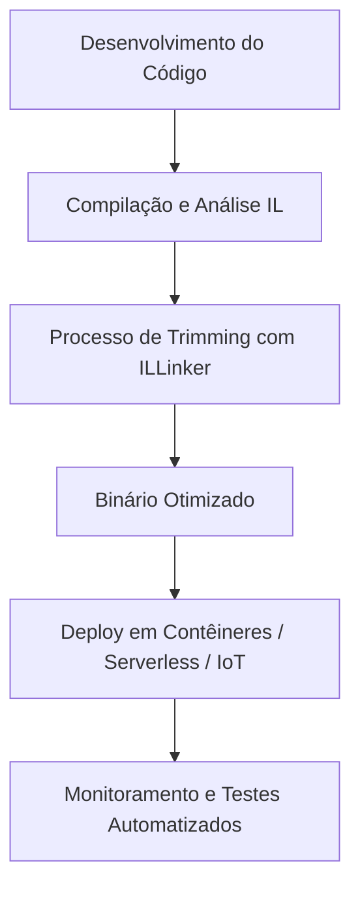
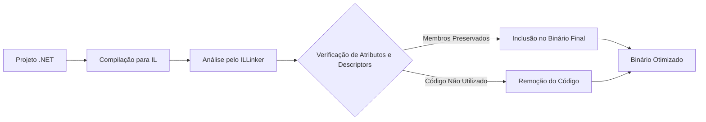
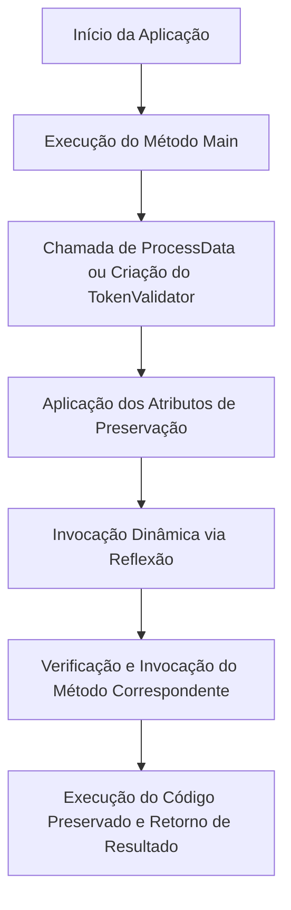
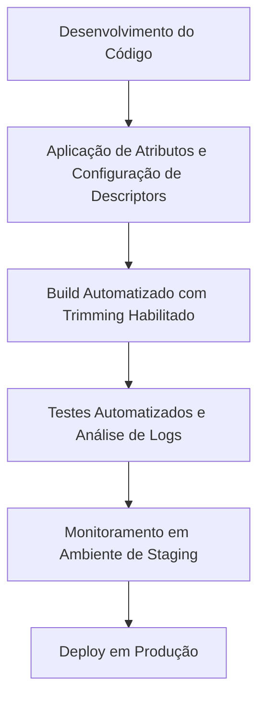

<!--
title: "Trimming no .NET: Otimizando Aplicações com Segurança, Performance e Confiabilidade"
description: "Artigo técnico abrangente sobre a funcionalidade de Trimming no .NET, explorando desde os conceitos básicos até práticas avançadas e exemplos práticos, com foco em código, melhores práticas e integração com microsserviços."
-->

# Trimming no .NET: Otimizando Aplicações com Segurança, Performance e Confiabilidade

## Introdução

O ecossistema .NET tem se destacado, ao longo dos últimos anos, por sua capacidade de inovação e adaptação às demandas de um mercado em constante evolução. Em especial, a otimização de binários e a redução de tempos de inicialização têm ganhado relevância para aplicações que operam em ambientes com recursos restritos ou que necessitam de respostas quase instantâneas, como é o caso de contêineres, soluções serverless e dispositivos IoT.

Uma das funcionalidades que possibilita essa otimização é o **Trimming**, uma técnica que remove, durante o processo de build, partes do código que não são utilizadas pela aplicação em tempo de execução. Inicialmente disponibilizado no .NET Core 3.0, o Trimming evoluiu significativamente – com aprimoramentos na análise estática e na integração com compilação Ahead-of-Time (AOT) – até alcançar seu suporte completo no **.NET 8** e versões superiores. Essa evolução permite que o Trimming seja aplicado de forma mais segura e eficiente, sem comprometer funcionalidades essenciais mesmo em cenários complexos, como aqueles que fazem uso intensivo de reflexão ou carregamento dinâmico de tipos.

Este artigo destina-se a desenvolvedores e arquitetos de software com conhecimento intermediário sobre AOT, que desejam aprofundar seus conhecimentos sobre a aplicação do Trimming no .NET. Ao longo deste texto, abordaremos:

- Os principais cenários de uso onde o Trimming pode trazer benefícios reais;
- Os conceitos fundamentais e a arquitetura que sustenta essa funcionalidade;
- Um exemplo prático detalhado, com código em C#, que demonstra a implementação e as precauções necessárias para evitar a remoção inadvertida de código essencial;
- Boas práticas que combinam performance, segurança e manutenibilidade;
- Exemplos avançados de integração com microsserviços e estratégias de monitoramento e testes.

Ao final deste artigo, o leitor estará apto a implementar o Trimming de forma segura e consciente, aproveitando as vantagens de um binário mais enxuto e performático, sem comprometer a integridade e a confiabilidade da aplicação.

---

## Contextualização (ou Cenários de Uso)

A utilização do Trimming no .NET não se limita apenas à redução do tamanho dos binários. Seus benefícios se estendem a diversas áreas que impactam diretamente a performance, a escalabilidade e a segurança das aplicações modernas. Nesta seção, exploraremos os principais cenários de uso e como o Trimming pode ser aplicado para otimizar o desempenho e reduzir a superfície de ataque.

### 1. Aplicações em Contêineres e Microsserviços

Em ambientes de contêineres, cada milissegundo de inicialização conta. Aplicações empacotadas em contêineres exigem imagens leves para reduzir o tempo de deploy e melhorar a escalabilidade. O Trimming remove partes do código que não são utilizadas, resultando em binários menores e, consequentemente, em imagens de contêineres mais enxutas. Essa redução não apenas acelera o tempo de inicialização, mas também diminui o consumo de recursos em ambientes altamente dinâmicos.

Em arquiteturas baseadas em microsserviços, onde cada serviço é desenvolvido, implantado e escalado de forma independente, a consistência e a integridade dos contratos de comunicação entre os serviços são fundamentais. O Trimming, quando aplicado com cautela, pode ajudar a manter esses contratos intactos, desde que as dependências dinâmicas sejam devidamente anotadas para preservação.

### 2. Soluções Serverless

Funções e aplicações serverless, como aquelas implementadas no Azure Functions ou AWS Lambda, são sensíveis ao tempo de "cold start" – o intervalo necessário para inicializar uma função inativa. A redução do tamanho do binário, proporcionada pelo Trimming, pode diminuir significativamente esse tempo de inicialização, oferecendo uma experiência mais responsiva e melhorando a escalabilidade sob demanda.

### 3. Dispositivos IoT e Ambientes com Recursos Limitados

Dispositivos de Internet das Coisas (IoT) e sistemas embarcados geralmente possuem limitações severas de memória e poder de processamento. A aplicação do Trimming nesses cenários permite a remoção de código redundante ou não utilizado, garantindo que apenas o essencial seja carregado em tempo de execução. Isso pode resultar em um uso mais eficiente dos recursos, prolongando a vida útil do dispositivo e melhorando a performance geral.

### 4. Segurança e Redução da Superfície de Ataque

Cada linha de código em um binário pode representar uma potencial vulnerabilidade. Ao remover código que não é utilizado, o Trimming reduz a superfície de ataque da aplicação, eliminando funcionalidades que poderiam ser exploradas por agentes maliciosos. Essa prática é especialmente relevante em aplicações que lidam com dados sensíveis, pois minimiza a possibilidade de exploração de código obsoleto ou não monitorado.

### 5. Integração com Pipelines de Build e CI/CD

A automação de builds e deploys através de pipelines de CI/CD (Integração Contínua/Entrega Contínua) é uma prática comum no desenvolvimento moderno. Integrar o Trimming nesse processo garante que todas as builds sejam otimizadas, possibilitando a identificação precoce de problemas decorrentes da remoção de código. Essa integração permite que os times de desenvolvimento mantenham um alto padrão de qualidade e performance, sem comprometer a confiabilidade do sistema.

### Diagrama: Cenários de Uso do Trimming

A seguir, um diagrama Mermaid que ilustra os principais cenários de uso do Trimming e como ele se integra ao fluxo de desenvolvimento e implantação:



Cada etapa desse fluxo enfatiza a importância de um processo robusto de build, onde o Trimming é integrado ao pipeline para garantir que o binário final seja otimizado sem comprometer funcionalidades essenciais.

---

## Conceitos e Arquitetura (ou Fundamentos)

Para compreender plenamente o impacto do Trimming no .NET, é necessário mergulhar nos seus fundamentos e na arquitetura que possibilita essa funcionalidade. Nesta seção, exploraremos os conceitos básicos, os componentes envolvidos e os desafios técnicos que surgem quando se tenta remover código de forma segura.

### 1. Definição e Objetivos do Trimming

O **Trimming** é um processo de pós-compilação que analisa o código intermediário (IL – Intermediate Language) gerado pelo compilador e remove os trechos de código que não são referenciados ou utilizados durante a execução da aplicação. O principal objetivo é produzir um binário final mais enxuto, o que pode resultar em:

- **Melhoria do Tempo de Inicialização:** Binários menores são carregados mais rapidamente, o que é crucial para aplicações serverless e contêineres.
- **Redução do Consumo de Memória:** Remover código desnecessário pode diminuir o footprint de memória da aplicação.
- **Aumento da Segurança:** Ao eliminar código que não é utilizado, a superfície de ataque é reduzida, minimizando possíveis vetores de exploração.

### 2. Evolução Histórica do Trimming

A funcionalidade de Trimming foi introduzida inicialmente no .NET Core 3.0 com o intuito de permitir a criação de aplicações self-contained com binários de tamanho reduzido. Com o passar das versões – especialmente a partir do .NET 5 e .NET 6 – o processo de análise estática e a detecção de dependências dinâmicas foram aprimorados. Atualmente, no **.NET 8**, o Trimming se beneficia de diagnósticos avançados e de uma integração mais profunda com a compilação AOT, possibilitando uma remoção mais precisa e segura do código não utilizado.

### 3. Componentes do Processo de Trimming

O processo de Trimming no .NET é composto por diversos componentes que trabalham em conjunto para garantir a remoção correta e segura do código. Entre os principais componentes, destacam-se:

#### 3.1 ILLinker

O ILLinker é a ferramenta responsável por analisar o código IL gerado durante a compilação e identificar quais partes do código podem ser removidas. Ele aplica algoritmos de análise estática para detectar referências diretas e indiretas, tomando decisões baseadas em padrões e heurísticas. A eficácia do ILLinker depende, em grande parte, da clareza das referências no código e do uso correto de atributos de preservação.

#### 3.2 Atributos de Preservação

Em muitos casos, o código é acessado de forma dinâmica – por exemplo, através de reflexão ou carregamento condicional. Para que o ILLinker não remova esses elementos críticos, o .NET disponibiliza atributos como:

- **[DynamicallyAccessedMembers]:** Indica que determinados membros de uma classe devem ser preservados, mesmo que não haja referências estáticas diretas.
- **[Preserve]:** Em cenários onde a lógica de remoção é complexa, esse atributo (ou variações customizadas dele) pode ser utilizado para marcar classes e métodos que não devem ser eliminados.

O uso correto desses atributos é crucial para evitar que funcionalidades essenciais sejam removidas inadvertidamente.

#### 3.3 Arquivo de Descriptor (Linker XML)

Para projetos mais complexos, pode ser necessário utilizar um arquivo XML de descriptors que define explicitamente quais assemblies, namespaces ou tipos devem ser preservados durante o processo de Trimming. Esse arquivo atua como uma “lista branca” que orienta o ILLinker, garantindo que componentes dinâmicos não sejam removidos.

### 4. Análise Estática versus Análise Dinâmica

A principal dificuldade no Trimming reside na análise de código que é acessado dinamicamente. A análise estática consegue identificar dependências diretas, mas pode falhar em detectar chamadas que ocorrem ***via reflexão***. Para mitigar esse desafio, o .NET combina análise estática com informações fornecidas pelos desenvolvedores por meio de atributos e arquivos XML.

#### 4.1 Desafios da Análise Dinâmica

- **Reflexão:** Muitas aplicações utilizam reflexão para instanciar classes ou invocar métodos de forma dinâmica. Se o ILLinker não identificar essas referências, ele pode remover código vital.
- **Carregamento Condicional:** Em cenários onde o código é carregado com base em condições de execução (por exemplo, plugins ou módulos opcionais), a análise estática pode não ser suficiente para determinar a necessidade desses componentes.

#### 4.2 Estratégias de Mitigação

- **Utilização de Atributos:** Anotar métodos e propriedades com `[DynamicallyAccessedMembers]` ou `[Preserve]` para garantir que eles sejam mantidos.
- **Descriptors XML:** Configurar arquivos de descriptor que listem explicitamente os componentes críticos.
- **Testes Abrangentes:** Implementar uma suíte robusta de testes (unitários, integração e end-to-end) que valide o funcionamento completo da aplicação com o Trimming habilitado.

### Diagrama: Arquitetura do Processo de Trimming

A seguir, um diagrama que ilustra a arquitetura e o fluxo de dados durante o processo de Trimming:



Este diagrama demonstra como o ILLinker, em conjunto com os atributos e arquivos XML, decide quais partes do código devem ser mantidas e quais podem ser removidas sem comprometer a funcionalidade da aplicação.

---

## Exemplo Prático

Nesta seção, apresentaremos um exemplo prático detalhado de como configurar e utilizar o Trimming em um projeto .NET. Serão abordados desde os ajustes no arquivo de projeto até a implementação de código com atributos de preservação, com ênfase em exemplos que ilustram o uso seguro e eficiente dessa funcionalidade.

### 1. Configuração do Projeto (.csproj)

O primeiro passo para habilitar o Trimming é configurar o arquivo de projeto para que as propriedades necessárias sejam definidas. No exemplo a seguir, mostramos como configurar um projeto de console no .NET 8 para utilizar o Trimming durante o processo de publicação:

```csharp
<Project Sdk="Microsoft.NET.Sdk">
  
  <PropertyGroup>
    <OutputType>Exe</OutputType>
    <TargetFramework>net8.0</TargetFramework>
    <PublishTrimmed>true</PublishTrimmed>
    <!-- O TrimMode pode ser "link" para remoção agressiva ou "copyused" para uma abordagem mais conservadora -->
    <TrimMode>link</TrimMode>
  </PropertyGroup>
  
  <ItemGroup>
    <!-- Dependências adicionais podem exigir configurações específicas para compatibilidade com trimming -->
  </ItemGroup>
  
</Project>
```

### 2. Código-Fonte com Atributos de Preservação

A seguir, veja um exemplo de aplicação console em C# que utiliza atributos de preservação para garantir que métodos chamados dinamicamente não sejam removidos pelo processo de Trimming.

```csharp
using System;
using System.Diagnostics.CodeAnalysis;

namespace TrimmingDemo
{
    public class Program
    {
        public static void Main(string[] args)
        {
            Console.WriteLine("Aplicação iniciada com Trimming habilitado.");
            ProcessData("Dados de exemplo");
            DynamicInvocation(typeof(Helper));
        }
  
        // Garante que os métodos públicos do tipo associado sejam preservados
        [DynamicallyAccessedMembers(DynamicallyAccessedMemberTypes.PublicMethods)]
        public static void ProcessData(string data)
        {
            Console.WriteLine($"Processando: {data}");
        }
  
        public static void DynamicInvocation([DynamicallyAccessedMembers(DynamicallyAccessedMemberTypes.PublicMethods)] Type targetType)
        {
            // Invoca dinamicamente o método "Execute" da classe especificada
            var method = targetType.GetMethod("Execute");
            if (method != null)
            {
                method.Invoke(null, null);
            }
            else
            {
                Console.WriteLine("Método 'Execute' não encontrado.");
            }
        }
    }
  
    public static class Helper
    {
        public static void Execute()
        {
            Console.WriteLine("Método Execute invocado dinamicamente.");
        }
  
        // Outros métodos poderão ser adicionados conforme necessário
    }
}
```

### 3. Explicação Detalhada do Código

No exemplo acima, alguns pontos merecem destaque:

- **Configuração do Projeto:**  
  As propriedades `<PublishTrimmed>` e `<TrimMode>` garantem que, durante o processo de publicação, o Trimming seja aplicado para remover código não utilizado.

- **Uso de Atributos:**  
  O atributo `[DynamicallyAccessedMembers]` aplicado aos métodos `ProcessData` e `DynamicInvocation` assegura que os membros públicos necessários sejam preservados, mesmo quando acessados via reflexão.

- **Invocação Dinâmica:**  
  O método `DynamicInvocation` ilustra uma situação comum em que o código utiliza reflexão para invocar um método. Sem os atributos de preservação, o ILLinker poderia remover o método `Execute` da classe `Helper`, causando falhas em tempo de execução.

### 4. Integração Avançada com Microsserviços

Em ambientes de microsserviços, componentes são frequentemente carregados de forma dinâmica para permitir uma arquitetura modular e extensível. Considere o exemplo a seguir, que simula um serviço de autenticação que utiliza reflexão para instanciar validadores personalizados.

```csharp
using System;
using System.Reflection;
using System.Diagnostics.CodeAnalysis;

namespace AuthService
{
    public class TokenValidator
    {
        // Indica que os métodos públicos do tipo Validator devem ser preservados
        [DynamicallyAccessedMembers(DynamicallyAccessedMemberTypes.PublicMethods)]
        public Type ValidatorType { get; set; }
  
        public TokenValidator(Type validatorType)
        {
            ValidatorType = validatorType;
        }
  
        public bool ValidateToken(string token)
        {
            // Cria uma instância do validador dinamicamente e invoca o método "Validate"
            var instance = Activator.CreateInstance(ValidatorType);
            MethodInfo validateMethod = ValidatorType.GetMethod("Validate");
            if (validateMethod == null)
            {
                throw new InvalidOperationException("Método 'Validate' não encontrado no validador.");
            }
            return (bool)validateMethod.Invoke(instance, new object[] { token });
        }
    }
  
    public class DefaultValidator
    {
        public bool Validate(string token)
        {
            // Lógica simples de validação para fins de demonstração
            return !string.IsNullOrEmpty(token) && token.Length > 10;
        }
    }
  
    public class Program
    {
        public static void Main(string[] args)
        {
            Console.WriteLine("Serviço de Autenticação com Trimming ativado.");
            // Cria uma instância de TokenValidator utilizando o DefaultValidator
            TokenValidator validator = new TokenValidator(typeof(DefaultValidator));
            bool isValid = validator.ValidateToken("TokenExemploSegur0!");
            Console.WriteLine($"Token válido: {isValid}");
        }
    }
}
```

### 5. Fluxo de Execução do Exemplo Prático

Para visualizar melhor o processo, o diagrama abaixo ilustra o fluxo de execução do exemplo prático, destacando como o Trimming interage com a invocação dinâmica e a preservação de código:



Este fluxo enfatiza a importância de anotar corretamente os métodos e tipos que podem ser acessados de forma dinâmica, garantindo que o ILLinker preserve esses componentes críticos.

---

## Boas Práticas

Para utilizar o Trimming de forma eficaz e segura, é fundamental adotar um conjunto de boas práticas que garantam a integridade da aplicação. Nesta seção, discutiremos recomendações essenciais, com ênfase em performance, segurança e integração com ambientes complexos como microsserviços.

### 1. Uso Adequado de Atributos de Preservação

- **[DynamicallyAccessedMembers]:**  
  Utilize este atributo em métodos, propriedades e parâmetros que podem ser acessados dinamicamente. Ele informa ao ILLinker que determinados membros não devem ser removidos, mesmo que não haja referências estáticas evidentes no código.

- **[Preserve] ou Atributos Customizados:**  
  Em cenários onde o uso de reflexão é mais complexo ou em bibliotecas de terceiros, considere a utilização de atributos customizados para marcar classes e métodos críticos. Esses atributos ajudam a criar uma “lista branca” de componentes que devem ser mantidos.

### 2. Configuração de Arquivos XML de Descriptors

- **Arquivo Linker XML:**  
  Para projetos com múltiplos assemblies ou com alto grau de dinamismo, configure um arquivo XML que especifique explicitamente os namespaces, assemblies ou tipos que devem ser preservados. Essa abordagem fornece um controle granular e pode ser combinada com os atributos no código.

- **Documentação Interna:**  
  Mantenha um registro documentado dos componentes marcados para preservação. Essa documentação auxilia na manutenção e atualização do projeto, garantindo que futuras alterações não comprometam a integridade do binário final.

### 3. Integração Contínua e Testes Automatizados

- **Builds Automatizados com Trimming Habilitado:**  
  Configure seus pipelines de CI/CD para compilar versões trimmed da aplicação e executar testes abrangentes (unitários, integração e end-to-end). Isso permite detectar precocemente problemas decorrentes da remoção de código essencial.

- **Testes de Regressão:**  
  Execute testes de regressão específicos para validar a integridade das funcionalidades que utilizam reflexão ou carregamento dinâmico, garantindo que o Trimming não cause falhas em tempo de execução.

### 4. Monitoramento e Diagnóstico

- **Logs Detalhados:**  
  Ative logging detalhado durante a execução da aplicação para identificar possíveis comportamentos anômalos que possam estar relacionados à remoção de código crítico. Utilize as ferramentas de diagnóstico do .NET 8 para monitorar warnings e mensagens emitidas pelo ILLinker.

- **Monitoramento em Produção:**  
  Implemente sistemas de monitoramento para capturar e analisar métricas de performance e segurança, assegurando que o binário final opere conforme o esperado mesmo após a aplicação do Trimming.

### 5. Dicas de Performance e Segurança

- **Otimização da Inicialização:**  
  A redução do tamanho do binário resulta em tempos de startup mais rápidos, o que é crucial para aplicações serverless e contêineres. Monitore a performance da inicialização e ajuste as configurações conforme necessário.

- **Redução do Uso de Memória:**  
  Aplicações trimmed tendem a consumir menos memória, permitindo uma melhor alocação de recursos em dispositivos com restrição de hardware.

- **Minimização da Superfície de Ataque:**  
  Remover código não utilizado diminui a possibilidade de exploração de funcionalidades desnecessárias, aumentando a segurança geral da aplicação. Certifique-se de que os componentes sensíveis estejam sempre preservados através de anotações e configurações específicas.

### 6. Exemplos Avançados de Integração com Microsserviços

- **Preservação de Contratos de Comunicação:**  
  Em uma arquitetura de microsserviços, é fundamental preservar interfaces, DTOs e contratos de comunicação. Utilize atributos de preservação nestes componentes para evitar que o Trimming remova partes críticas da comunicação entre serviços.

- **Sincronização entre Serviços:**  
  Garanta que todos os serviços que compõem a arquitetura estejam utilizando configurações de trimming compatíveis. Realize testes de integração para verificar a comunicação e o comportamento dos serviços em conjunto.

- **Exemplo Prático em Ambiente Distribuído:**  
  Considere um cenário onde um serviço de autenticação utiliza reflexão para instanciar validadores personalizados carregados de um repositório centralizado. Utilize atributos de preservação para assegurar que os validadores permaneçam intactos e funcionais, mesmo com o Trimming aplicado.

### Diagrama: Boas Práticas no Processo de Trimming



Este diagrama ilustra a importância de integrar práticas de desenvolvimento, testes e monitoramento ao longo do ciclo de vida da aplicação, garantindo que o Trimming seja aplicado de forma segura e eficaz.

---

## Conclusão

O Trimming no .NET representa uma evolução significativa na forma como as aplicações são otimizadas e distribuídas. Ao remover código não utilizado, essa funcionalidade permite a criação de binários mais enxutos, com inicialização mais rápida, menor consumo de memória e uma superfície de ataque reduzida. Desde sua introdução no .NET Core 3.0 até os aprimoramentos implementados no .NET 8, o Trimming tem se mostrado indispensável em cenários que vão desde aplicações serverless e contêineres até dispositivos IoT e arquiteturas de microsserviços.

Neste artigo, exploramos em detalhes:

- **Introdução e Contextualização:**  
  Discutimos os cenários de uso do Trimming, destacando suas aplicações em ambientes modernos e a importância de otimizar binários para performance e segurança.

- **Conceitos e Arquitetura:**  
  Apresentamos os fundamentos teóricos do Trimming, os componentes envolvidos (como o ILLinker, atributos de preservação e arquivos XML de descriptors) e os desafios associados à análise estática e dinâmica.

- **Exemplo Prático:**  
  Foram fornecidos exemplos detalhados de configuração e código em C#, demonstrando como utilizar os atributos de preservação e como integrar o Trimming em cenários que envolvem reflexão e microsserviços.

- **Boas Práticas:**  
  Discutimos recomendações essenciais para evitar a remoção inadvertida de código crítico, enfatizando a importância de testes automatizados, monitoramento e uma abordagem cuidadosa ao lidar com código dinâmico.

A adoção do Trimming deve ser encarada não apenas como uma técnica de redução de tamanho, mas como parte integrante de uma estratégia abrangente de otimização e segurança. Desenvolvedores e arquitetos que investem em uma implementação cuidadosa e em boas práticas poderão aproveitar ao máximo os benefícios oferecidos pelo Trimming, garantindo que suas aplicações sejam tanto performáticas quanto robustas.

À medida que o .NET continua evoluindo, espera-se que novas ferramentas e melhorias no processo de Trimming venham a oferecer ainda mais controle e visibilidade sobre o código removido, permitindo um equilíbrio cada vez mais refinado entre performance, segurança e funcionalidade.

---

## Referências

- [Opções de corte](https://learn.microsoft.com/pt-br/dotnet/core/deploying/trimming/trimming-options) ou [Cortar implantações e executáveis autossuficientes](https://learn.microsoft.com/pt-br/dotnet/core/deploying/trimming/trim-self-contained)
- [Guia de AOT no .NET](https://learn.microsoft.com/dotnet/core/deploying/ready-to-run)
- [Atributo DynamicallyAccessedMembers no .NET](https://learn.microsoft.com/dotnet/api/system.diagnostics.codeanalysis.dynamicallyaccessedmembersattribute)
- [Melhores Práticas para Publicação de Aplicações .NET](https://learn.microsoft.com/dotnet/core/deploying/)
- [ILLinker GitHub Repository](https://github.com/mono/linker)
- [Integração de Microsserviços com .NET – Padrões e Práticas](https://learn.microsoft.com/dotnet/architecture/microservices/)
  - *Reposito arquivado, mas possue referencias.
- [Segurança em Aplicações .NET: Reduzindo a Superfície de Ataque com Trimming](https://learn.microsoft.com/dotnet/standard/security/)
- [Monitoramento e Diagnóstico no .NET](https://learn.microsoft.com/dotnet/core/diagnostics/)

---

*Nota Final:*  
Este artigo procurou apresentar uma análise abrangente e detalhada sobre o Trimming no .NET, combinando conceitos teóricos com exemplos práticos e recomendações avançadas. A complexidade e a evolução contínua da tecnologia .NET incentivam a consulta regular da documentação oficial e de fontes especializadas para se manter atualizado com as melhores práticas e inovações no assunto.

---

*Esta obra técnica destina-se a servir como referência completa para desenvolvedores avançados que desejam explorar todas as nuances do Trimming no .NET, desde os conceitos fundamentais até a implementação em ambientes complexos e distribuídos. Espera-se que as informações aqui contidas contribuam para a criação de aplicações mais seguras, eficientes e preparadas para os desafios do desenvolvimento moderno.*
